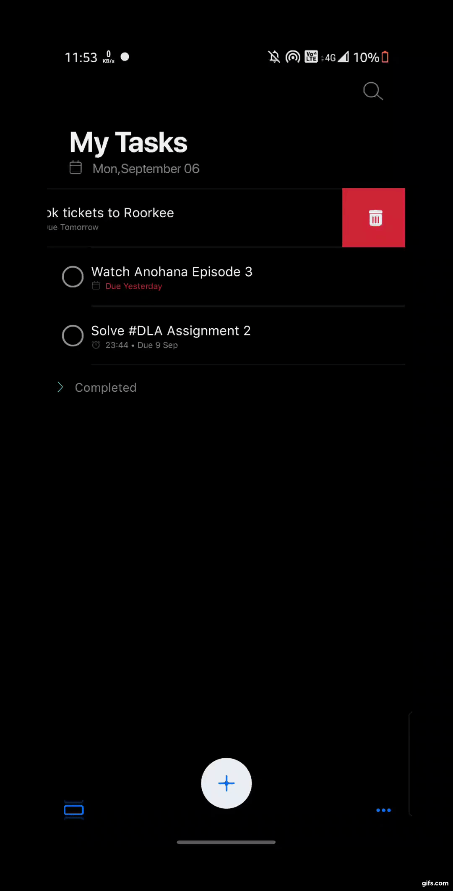

To-do-android
=================

It's a simple TODO list application on the Android OS.

It's based on Model-View-View-Model(MVVM) Architecture and uses modern android libraries susch as Jetpack, Room and Co-routines.

Getting Started
---------------

The signed apk will be updated to the newest versions, You can download it [here](https://github.com/xtanion/To-do-android/tree/main/release) & install it manually and allow the run-time permissions. ***Sign In with google may not work in Release Apk*** here's the [reason](https://stackoverflow.com/questions/40864684/firebase-authentication-not-working-in-signed-apk).

This project uses the Gradle build system. To build this project, use the gradlew build command or use "Import Project" in Android Studio.

In order to test the Firebase Login and RealTime database you have to create <code>google-services.json</code> file and add it into <code>/ToDo/app</code>.

Libraries Used
--------------

* [Architecture][1] - A collection of libraries that help you design robust, testable, and
  maintainable apps. Start with classes for managing your UI component lifecycle and handling data
  persistence.
* [Data Binding][2] - Declaratively bind observable data to UI elements.
* [Lifecycles][3] - Create a UI that automatically responds to lifecycle events.
* [LiveData][4] - Build data objects that notify views when the underlying database changes.
* [Navigation][5] - Handle everything needed for in-app navigation.
* [Safe Args][17] - Paasing arguments b/w Fragments.
* [Room Database][6] - Access your app's SQLite database with in-app objects and compile-time checks.
* [ViewModel][7] - Store UI-related data that isn't destroyed on app rotations. Easily schedule
     asynchronous tasks for optimal execution.
* [WorkManager][8] - Manage your Android background jobs.
* [UI][9] - Details on why and how to use UI Components in your apps - together or separate
  * [Animations & Transitions][10] - Move widgets and transition between screens.
  * [Fragment][11] - A basic unit of composable UI.
  * [Layout][12] - Lay out widgets using different algorithms.
* Third party and miscellaneous libraries
  * [Gson][13] -  to convert Strings & Lists into Json Object and vice-versa
  * [Glide][14] - for image loading
  * [Lottie][15] - for animated GIFs/animated icons
  * [Kotlin Coroutines][16] - for managing background threads with simplified code and reducing needs for callbacks

[0]: https://developer.android.com/jetpack/components
[1]: https://developer.android.com/jetpack/arch/
[2]: https://developer.android.com/topic/libraries/data-binding/
[3]: https://developer.android.com/topic/libraries/architecture/lifecycle
[4]: https://developer.android.com/topic/libraries/architecture/livedata
[5]: https://developer.android.com/topic/libraries/architecture/navigation/
[6]: https://developer.android.com/topic/libraries/architecture/room
[7]: https://developer.android.com/topic/libraries/architecture/viewmodel
[8]: https://developer.android.com/topic/libraries/architecture/workmanager
[9]: https://developer.android.com/guide/topics/ui
[10]: https://developer.android.com/training/animation/
[11]: https://developer.android.com/guide/components/fragments
[12]: https://developer.android.com/guide/topics/ui/declaring-layout
[13]: https://github.com/google/gson
[14]: https://bumptech.github.io/glide/
[15]: https://github.com/lottiefiles
[16]: https://kotlinlang.org/docs/reference/coroutines-overview.html

Screenshots
-----------

Upcoming features
-----------------
